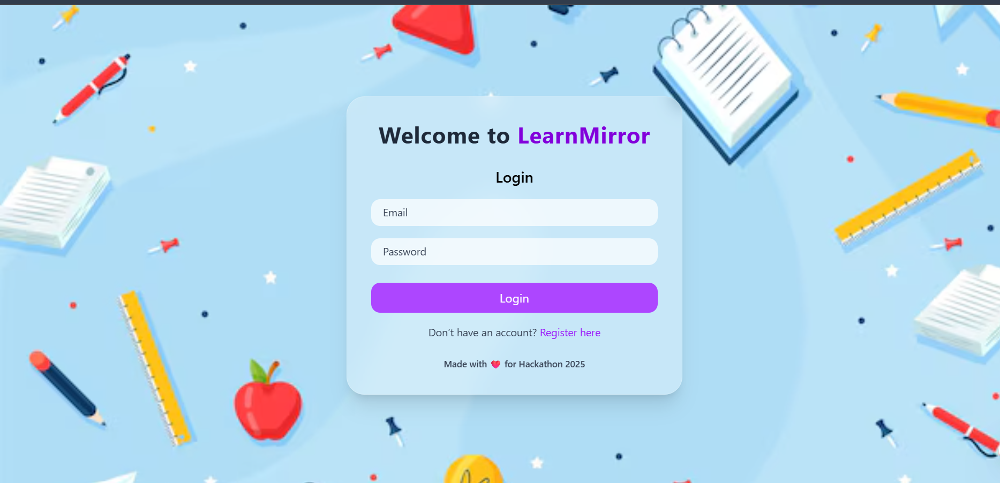
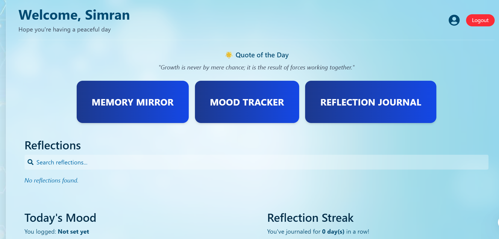
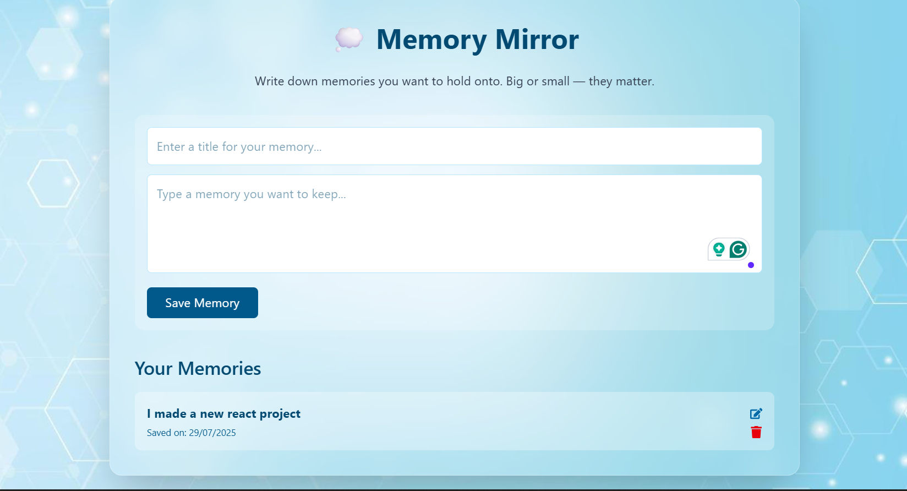
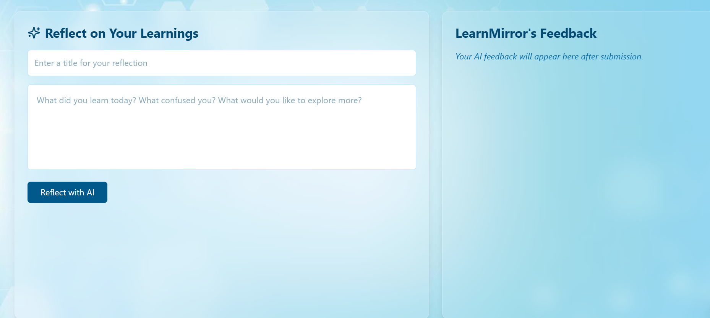
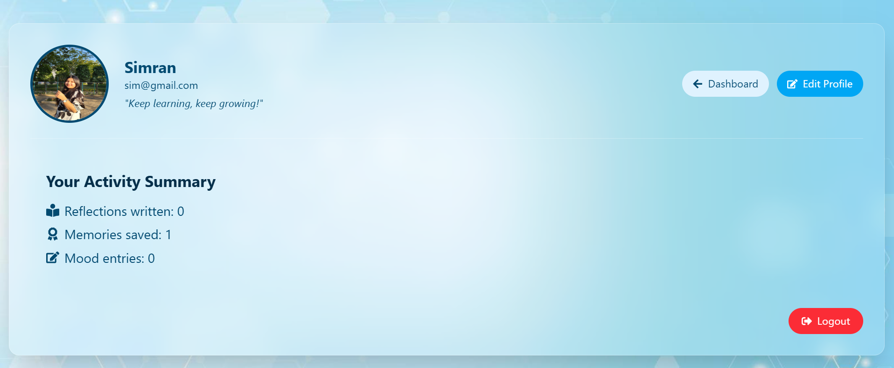
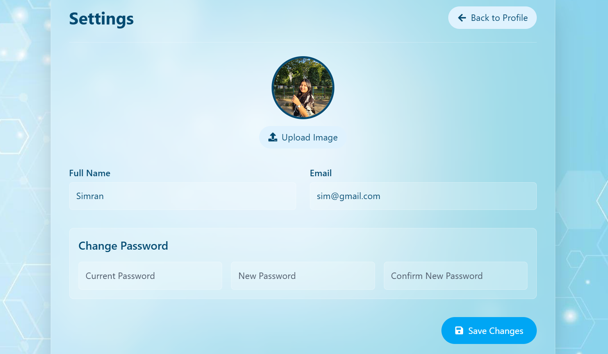

# 🌟 LearnMirror

**LearnMirror** is a self-growth companion web app built with **React** that helps users reflect, grow, and track their mental well-being. It uses the browser's **localStorage** for data persistence — making it lightweight, fast, and completely private on the user's device.

---

## 🔗 Live Demo

👉 [View Live Project](https://learn-mirror-react-app.vercel.app/)  

---

##  Features

###  Reflection Journal  
- Add, edit, view, and delete personal reflections.  
- Reflections are stored with titles and timestamps.  
- Stored locally in your browser using **localStorage**.  
- Fully searchable from the dashboard.

###  Memory Mirror  
- Save precious memories with a **title and content**.  
- View and relive stored memories anytime.  
- All memories are organized neatly by title.  

###  Mood Tracker  
- Choose your current mood from a wide range of mood icons.  
- See your emotional trends over time.  
- Mood entries are saved with timestamps in **localStorage**.

###  Learning Goals  
- Set short-term and long-term learning goals.  
- Mark them as completed or update them any time.  
- All progress is saved in localStorage for daily motivation.

###  User Profile  
- Display user **photo**, **name**, and **email** on a clean profile screen.  
- Easily navigate to different areas of the app using quick links.

### Local Authentication 
- Simple **Login/Register** flow using localStorage.  
- No external APIs — all user info is stored securely on the browser.  
- Once logged in, users can access personalized dashboards.

---

##  Tech Stack

- **React**
- **Tailwind CSS**
- **React Router**
- **localStorage** for persistent data

---

##  Local Setup

```bash
git clone https://github.com/your-username/learnmirror.git
cd learnmirror
npm install
npm run dev
```

---

##  UI Screens

| Login Page | Dashboard | 
|-----------|--------------|
|  |  |

| MirrorMemory Page | ReflectionJournal Page |
|------------------|----------|
| |  |

| Profile | Settings Page  | 
|-----------|--------------|
|  |  | 


## Contact

For any inquiries or feedback, please contact:

- **Name**: Simran  
- **GitHub**: [SIMRAN-202](https://github.com/SIMRAN-202)  
- **Email**: kaursimrankaur2003@gmail.com